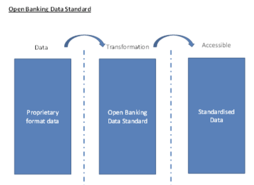

# 7a. 8 Data Standards
## 7a. 8.1 Requirement for standardised business data

For the Open Banking Standard to reach its full potential, common business semantics (i.e. the meaning and understanding of data) and data consistency must be addressed.

A Data Standard (reference data model) is therefore needed to simplify and standardise data required for the Open Banking API. This is vital in ensuring that common data is made available in a uniform and consistent manner. Harmonisation will also allow non-standardised proprietary data to be made available in a common standardised way, enabling consistent usage.

For example, if the Open Banking API is used to source interest rates for personal current accounts and business accounts, each provider of that information (operating under the Open Banking Standard) would make that data available in a uniform and consistent structure, so that it can be called upon in an interoperable manner. It is recognised that harmonisation across all institutions represents a challenge.

# 7a. 8.2 Reference data model

The reference data model will describe data that is shared under the Open Banking Standard in a manner that is technology-neutral, consistent, reusable and well defined. It will form a library of structured and individual business components, data components and data structures (data types or patterns) described in a uniform notation. The model will be used by all those that adhere to the Open Banking Standard (a similar approach has been implemented by the World Customs Organisation). ([ref19](htp://www.wcoomd.org/en/topics/facilitaton/resources/~/media/70998C307D3C47C996DB047B664B92AE.ashx))

Data sets will be developed based on the scope of the data necessary to support the functionality of the core. Data elements and code lists will be aligned to the greatest extent possible with existing international data standards. Over time, as the scope of the data extends so too will the reference data model.

At this stage, it is still open to further investigation whether existing data models can be reused, such as the ISO 20022 Financial Repository ([ref20](htps://www.iso20022.org/fnancial_repository.page)), or whether the Open Banking Standard will need to define and maintain a separate reference data model.

For further detail on existing data standards, please refer to Appendix 7: Existing data standards.

# 7a. 9 Open Data

Open data (as defined in Chapter 5) should be accessible via the Open Banking API and have its terminology harmonised through the reference data model (see section 8.2). Open data should form part of the core Open Banking API and therefore needs to be consistently implemented across all organisations.

Open data should also adhere to the principles of open access and treatment of IP (such as codes, software, reference data, etc.). The licence rights to use open data need to be clear and potentially included as a field within the JSON.

# 7c. 11. Approach to Open Data

By definition, there is no reason to restrict access to truly open data. Therefore, there is no need to prevent unauthorised access to open data (although there may be a need to restrict access for other reasons, such as preventing denial of service (DOS) attacks). If open data is to be accessed via the same API that provides access to customers’ accounts, provision must be made for a level of access that does not require authentication (permission level zero, as opposed to no authentication).

There may be a need to protect the integrity of open data and prevent alteration of open data by bad actors. Therefore, the infrastructure used to provide access to open data should be secured to prevent unauthorised alteration. Authentication of the source of the data may also be required.

Finally, if personal data is anonymised in order to facilitate its publication as open data, care must be taken to ensure that the steps taken to anonymise it preclude de-anonymisation (including through the combination of multiple open data sets). There is more discussion in chapter 9.

# Appendix 5: Detailed indicative data release

**Table A5.1 Data scope**

|Req. ref |Data class |Schema |Attribute L1 |Attribute L2 |Attribute L3 |
|:--- |:--- |:--- |:--- |:--- |:--- |
|R001 |Open data |Provider name ||||
|R002 |Open data |Branch(s) ||||
|R003 |Open data ||Location |||
|R004 |Open data ||Address |||
|R005 |Open data ||Hours |||
|R006 |Open data ||Facilities |||
|R007 |Open data ||Services |||
|R008 |Open data |Contact(s) ||||
|R009 |Open data ||Type |||
|R010 |Open data ||Contact |||
|R011 |Open data ||Purpose |||
|R012 |Open data ||Note |||
|R013 |Open data |ATM(s) ||||
|R014 |Open data ||Location |||
|R015 |Open data ||Address |||
|R016 |Open data ||Services |||
|R017 |Open data ||Status |||
|R018 |Open data |Digital service(s) ||||
|R019 |Open data ||Type ||
|R020 |Open data ||URL ||
|R021 |Open data ||Requirements ||
|R022 |Open data ||Note ||
|R023 |Open data |Product(s) |||
|R024 |Open data ||Type ||
|R025 |Open data ||Description ||
|R026 |Open data ||Benefits ||
|R027 |Open data ||Charges ||
|R028 |Open data ||Demographic ||
|R029 |Open data ||Accept rate ||
|R030 |Open data ||Legacy ||
|R031 |Open data ||Eligibility ||
|R032 |Non-public customer facing data |Account holder |||
|R033 |Non-public customer facing data |Account holder DOB |||
|R034 |Non-public customer facing data |Account holder address |||
|R035 |Non-public customer facing data |Account holder contact(s) |||
|R036 |Non-public customer facing data ||Type ||
|R037 |Non-public customer facing data ||Contact ||
|R038 |Non-public customer facing data |Account(s) |||
|R039 |Non-public customer facing data ||Account name ||
|R040 |Non-public customer facing data ||Account type ||
|R041 |Non-public customer facing data ||Activity available from ||
|R042 |Non-public customer facing data ||Account number ||
|R043 |Non-public customer facing data ||Sort code ||
|R044 |Non-public customer facing data ||IBAN ||
|R045 |Non-public customer facing data ||Balance ||
|R046 |Non-public customer facing data ||Statement from ||
|R047 |Non-public customer facing data ||Statement to ||
|R048 |Non-public customer facing data ||Opening balance ||
|R049 |Non-public customer facing data ||Closing balance ||
|R050 |Non-public customer facing data ||Debit system ||
|R051 |Non-public customer facing data ||Card type ||
|R052 |Non-public customer facing data ||ATM limit ||
|R053 |Non-public customer facing data ||Manage via ||
|R054 |Non-public customer facing data |||Branch |
|R055 |Non-public customer facing data |||Online |
|R056 |Non-public customer facing data |||Post |
|R057 |Non-public customer facing data |||Post office |
|R058 |Non-public customer facing data |||Telephone |
|R059 |Non-public customer facing data |||Text alerts |
|R060 |Non-public customer facing data |||Smartphone |
|R061 |Proprietary data ||Interest payment frequency ||
|R062 |Proprietary data ||Interest payment method ||
|R063 |Proprietary data ||Interest rate type ||
|R064 |Proprietary data ||Representative example ||
|R065 |Proprietary data ||Benefit(s) ||
|R066 |Proprietary data |||Type |
|R067|Proprietary data |||Note |
|R068|Proprietary data ||Eligibility ||
|R069|Proprietary data |||Age min |
|R070|Proprietary data |||Local area only |
|R071|Proprietary data |||Business only |
|R072|Proprietary data |||Visa holders allowed |
|R073|Proprietary data |||Northern Ireland only |
|R074|Proprietary data |||Islamic law |
|R075|Proprietary data |||Students only |
|R076|Proprietary data |||Upgrading customers only |
|R077|Proprietary data |||Fundings |
|R078|Proprietary data |||Financial income |
|R079|Proprietary data |||Residency |
|R080|Proprietary data ||Fee(s) ||
|R081|Proprietary data |||Type |
|R082|Proprietary data |||Frequency |
|R083|Proprietary data |||Amount |
|R084|Proprietary data |||Tier lower |
|R085|Proprietary data |||Tier higher |
|R086|Proprietary data ||Fee cap(s) ||
|R087|Proprietary data |||Fee count max |
|R088|Proprietary data |||Fee count max frequency |
|R089|Proprietary data |||Fee amount max frequency |
|R090|Proprietary data |||Fee type(s) |
|R091|Proprietary data |||Applies to |
|R092|Proprietary data ||Rate(s) ||
|R093|Proprietary data |||Annual interest AER |
|R094|Proprietary data |||Annual interest EAR |
|R095|Proprietary data |||Annual interest percentage type |
|R096|Proprietary data |||Annual interest yearly |
|R097|Proprietary data |||Applies to |
|R098 |Proprietary data |||Frequency |
|R099 |Proprietary data |||Period lower |
|R100 |Proprietary data |||Period upper |
|R101 |Proprietary data |||Tier lower |
|R102 |Proprietary data |||Tier upper |
|R103 |Proprietary data |||Transferred accounts only |
|R104 |Proprietary data |||Type |
|R105 |Non-public customer facing data ||Overdraft Buffer(s) ||
|R106 |Non-public customer facing data |||Type |
|R107 |Non-public customer facing data |||Applies to |
|R108 |Non-public customer facing data |||Amount |
|R109 |Non-public customer facing data |||Note |
|R110 |Non-public customer facing data ||Repayment ||
|R111 |Non-public customer facing data |||Minimum payment required |
|R112 |Non-public customer facing data |||Minimum payment due |
|R113 |Non-public customer facing data |||Charge(s) |
|R114 |Non-public customer facing data |||Statement of arrears? |
|R115 |Non-public customer facing data ||Transaction(s) ||
|R116 |Non-public customer facing data |||Transaction ID |
|R117 |Non-public customer facing data |||Posted date |
|R118 |Non-public customer facing data |||Transaction date |
|R119 |Non-public customer facing data |||Amount |
|R120 |Non-public customer facing data |||Description |
|R121 |Non-public customer facing data |||Credit/debit |
|R122 |Non-public customer facing data |||Currency |
|R123 |Non-public customer facing data |||Type |
|R124 |Non-public customer facing data |||Is recurring |
|R125 |Non-public customer facing data |||Recurring frequency |
|R126 |Non-public customer facing data |||Merchant |
|R127 |Non-public customer facing data ||||Merchant ID 
|R128 |Non-public customer facing data ||||Merchant category code 
|R129 |Non-public customer facing data ||||Merchant category code name 
|R130 |Non-public customer facing data ||||Merchant name 
|R131 |Non-public customer facing data ||||Merchant location 
|R132 |Non-public customer facing data ||||Market segment code 
|R133 |Non-public customer facing data ||||Transaction auth date 
|R134 |Non-public customer facing data ||||Transaction auth time 
|R135 |Non-public customer facing data ||||Authorisation time of transaction 
|R136 |Non-public customer facing data ||||Approval/denial reason code 
|R137 |Non-public customer facing data ||||Approval denial reason type 
|R138 |Non-public customer facing data ||||Cash back flag 
|R139 |Non-public customer facing data ||||System transaction code 
|R140 |Non-public customer facing data ||||Cardholder ID method 
|R141 |Non-public customer facing data ||||POS entry mode 
|R142 |Non-public customer related data |Maintainer |||
|R143 |Non-public customer related data |Created date |||
|R143 |Non-public customer related data |Last updated |||